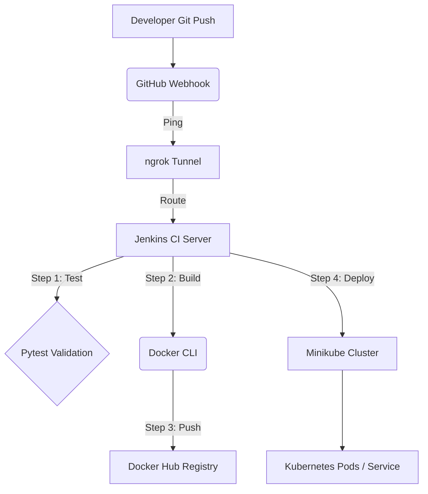

# 🌐 TaskForce: End-to-End DevOps Architecture Walkthrough

This document serves as a comprehensive guide to understanding exactly how this project functions across all layers. Use this guide to flawlessly explain the architecture during your Demo or Viva!

## 1. High-Level Architecture Flow

The core focus of this project is the **Continuous Integration / Continuous Deployment (CI/CD)** pipeline. It proves zero-touch deployments: from a simple codebase edit to live production hosting without manual intervention.

---

## 2. The Application Layer (Python + UI)
**Where code lives:** `app.py`, `/static/` folder

*   **Backend Database & Logic:** We use Python's **Flask** framework to spin up a lightweight REST API server. It manages an in-memory dictionary acting as our "database" and handles HTTP requests (`POST`, `GET`, `PUT`, `DELETE`).
*   **Frontend UI:** Natively served by Flask. When you visit the root URL (`/`), Flask sends `static/index.html`. 
*   **The Magic:** The browser executes `script.js`, which fires active network calls back to the Flask API. We use sleek **Glassmorphism CSS** to style the DOM on the fly, creating dynamic task tracking states.

---

## 3. The Dockerization Layer
**Where code lives:** `Dockerfile`, `docker-compose-jenkins.yml`, `Dockerfile.jenkins`

*   **Why we need it:** Containerization guarantees that our app will run exactly the same way on any machine in the universe. 
*   **App Container:** `Dockerfile` packages our Python code, installs dependencies (`requirements.txt`), and exposes port `5000`.
*   **Jenkins Custom Container** (`Dockerfile.jenkins`): Because Jenkins naturally doesn't know how to run Python or understand Kubernetes commands, we built a highly customized Jenkins server image that forces Docker, Python3, and Kubectl integration out-of-the-box.

---

## 4. The Jenkins CI/CD Pipeline
**Where code lives:** `Jenkinsfile`

This is the brain of the DevOps infrastructure. It utilizes a declarative pipeline workflow:

| Stage | Objective | Mechanism |
| :--- | :--- | :--- |
| **Checkout** | Source code retrieval | Hooks into your main GitHub repository securely pulling the latest changes. |
| **Install & Test** | Code Quality | Validates code health instantly by running `python -m pytest`. If tests fail, the entire pipeline safely aborts, protecting production. |
| **Build & Push** | Compilation | Executes `docker build`, tags the image with a unique tracking number (`BUILD_NUMBER`), and authentically publishes it securely up to **DockerHub**. |
| **Deploy** | Kubernetes Integration | Dynamically intercepts and rewrites the `k8s/deployment.yaml` tracking tag, then securely pushes the state instructions down to Minikube using `kubectl`. |

> [!CAUTION]
> **Authentication Bridging:** The core complexity of this pipeline was successfully passing your secret credentials from DockerHub into the pipeline safely, and translating your Windows Minikube certificates into absolute Linux path symlinks so Jenkins could securely authenticate the K8s cluster!

---

## 5. The Kubernetes Deployment
**Where code lives:** `/k8s/deployment.yaml`, `/k8s/service.yaml`

Once Jenkins orders the deployment, Kubernetes takes complete control of maintaining application uptime.

*   **Deployment Controller:** Orders the creation of 2 isolated **Replica Pods** of your Application. If one node randomly crashes, K8s automatically self-heals by spinning up a new container immediately.
*   **Health Probes:** Kubernetes checks the `/health` endpoint every few seconds. It refuses to serve traffic to a pod until it returns a positive HTTP 200 health status.
*   **NodePort Service:** Kubernetes securely exposes its internal container network to the outside world, assigning a high network port (e.g. `30001` or dynamic assignment) allowing you to access the web app from your Windows browser.

> [!TIP]
> **Automatic Trigger (Webhooks):** 
> By running `ngrok`, we created a tunnel for GitHub's proprietary servers to securely connect to our localhost Jenkins workspace. When you `push`, GitHub instantly contacts the Ngrok tunnel, triggering Jenkins without human interaction. This is true DevOps orchestration!
